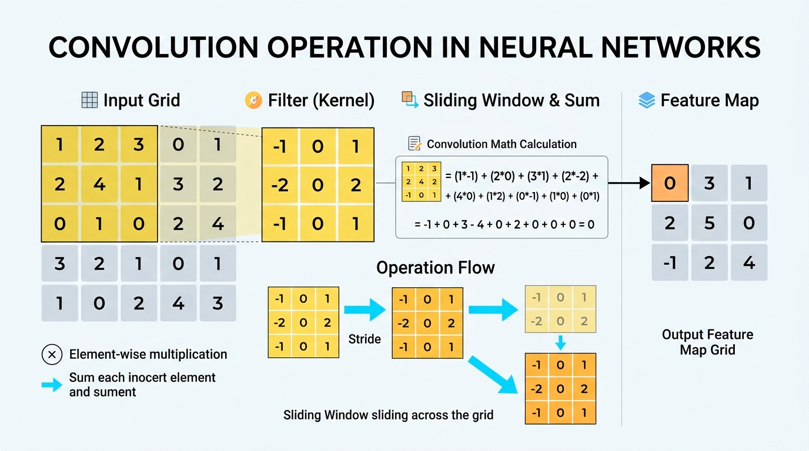

# Unit 2 – Core Convolutional Operations

# Chapter 2 – Padding, Strides, and Output Formulas

---

# Learning Objectives

After completing this chapter, you will be able to:

- Understand how the mathematical Convolution operation works.
- Calculate the output size of a feature map using the Basic Formula.
- Explain what Padding is and why it is necessary.
- Explain what Strides are and how they reduce spatial dimensions.
- Calculate the output size using the Advanced Formula (with Padding and Strides).

---

# 1. The Convolution Operation

Convolution is the mathematical process of sliding a filter over an input image, performing element-wise multiplication, and summing the results to produce a single number in the Feature Map.

### Step-by-Step:
1. Place the filter at the top-left corner of the input image.
2. Multiply each pixel in the image by the corresponding weight in the filter.
3. Sum all the multiplied values together to get a single number.
4. Place that number in the top-left cell of the Feature Map.
5. Slide the filter over by one pixel and repeat.

---

# 2. Basic Output Formula

When you slide a $3 \times 3$filter over a$5 \times 5$image, you cannot place the center of the filter on the very edge pixels without the filter falling off the image. 

Because of this, the output Feature Map will always be smaller than the original input image.

### The Basic Formula:
If the input image is$n \times n$and the filter is$f \times f$, the size of the output feature map is:$$\text{Output Size} = (n - f + 1) \times (n - f + 1)$$### Example:
- Input Image ($n$) = 6
- Filter ($f$) = 3
- Output Size =$(6 - 3 + 1) = 4$(So,$4 \times 4$)

### The Problem:
If the image shrinks slightly every time it passes through a Convolutional layer, a deep network with 50 layers would shrink the image down to nothing before it finishes! Furthermore, the pixels on the borders of the image are barely touched by the filter, leading to **loss of edge information**.

---

# 3. Padding

To prevent the image from shrinking and to preserve the edge information, we use **Padding**.

Padding means adding an artificial border of extra pixels around the outside of the image before performing the convolution. These extra pixels are usually set to `0` (Zero-Padding).

If we add a padding of$p = 1$, a$5 \times 5$image becomes a$7 \times 7$image. 
When we run a$3 \times 3$filter over it, the output remains$5 \times 5$!

### Standard Types of Padding:
1. **Valid Padding:** No padding is used ($p = 0$). The image shrinks.
2. **Same Padding:** Padding is added so that the output size exactly equals the input size.

---

# 4. Strides

By default, the filter slides over by 1 pixel at a time. This step size is called the **Stride** ($s = 1$).

Sometimes, we *want* the feature map to shrink quickly to reduce the computational load and extract higher-level features. We can achieve this by increasing the stride.

If we set **Stride ($s$) = 2**, the filter jumps by 2 pixels at a time. This effectively cuts the output size in half.

---

# 5. The Advanced Output Formula

When we factor in both Padding ($p$) and Strides ($s$), the formula to calculate the exact dimension of the output Feature Map is:$$\text{Output Size} = \left( \frac{n + 2p - f}{s} \right) + 1$$*(Note: The result is usually rounded down (floor) if it does not divide perfectly).*

### Example Calculation:
- Input Image ($n$) = 7
- Padding ($p$) = 1
- Filter ($f$) = 3
- Stride ($s$) = 2$$\text{Output} = \left( \frac{7 + 2(1) - 3}{2} \right) + 1$$
$$\text{Output} = \left( \frac{9 - 3}{2} \right) + 1 = \left( \frac{6}{2} \right) + 1 = 4$$The output feature map will be$4 \times 4$.

---

# Interview Questions

## Q1. Why do Convolutional Layers cause the input image to shrink?

**Answer**
The filter must fully overlap with the image pixels. Because the filter cannot hang off the edge of the image without padding, the center of the filter cannot reach the extreme border pixels, resulting in an output matrix that is smaller than the input matrix by $(f - 1)$.

---

## Q2. What is "Same Padding" and why is it used?

**Answer**
Same Padding refers to adding enough zeros around the border of an image so that the resulting feature map has the exact same dimensions as the input image. This is heavily used in deep CNNs to prevent the image from shrinking to 0 across many layers, and to ensure that border pixels are processed equally to center pixels.

---

# Summary

The math behind Convolution is simple multiplication and addition. However, managing the spatial dimensions of the feature maps is critical. We use the Output Formula to track dimensions, **Padding** to preserve dimensions and edge data, and **Strides** to aggressively downsample the image.

---

# Key Takeaways

✔ The Basic Formula is$n - f + 1$.
✔ Padding ($p$) adds a border (usually zeros) to preserve image size.
✔ Strides ($s$) control the step size of the filter; larger strides shrink the output.
✔ The Advanced Formula is$\frac{n + 2p - f}{s} + 1$.
