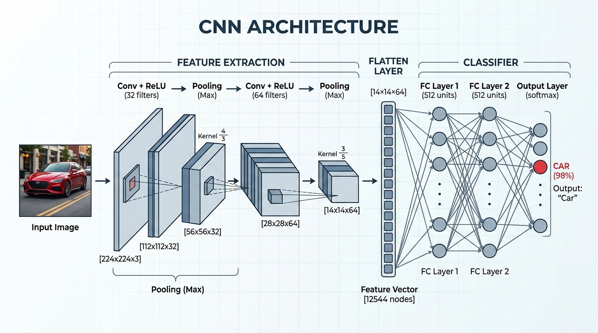

# Unit 3 – Pooling Layers and Architecture

# Chapter 2 – Standard CNN Structure

---

# Learning Objectives

After completing this chapter, you will be able to:

- Understand how Convolution and Pooling layers are combined.
- Define the two main sections of a CNN: The Feature Extractor and The Classifier.
- Understand the role of the Flatten layer.
- Visualize the full, end-to-end architecture of a standard Convolutional Neural Network.

---

# 1. Building a CNN

We have now learned about the three critical building blocks of a Convolutional Neural Network:
1. **Convolution Layers:** Extract features using learnable filters.
2. **Activation Functions (ReLU):** Introduce non-linearity.
3. **Pooling Layers:** Reduce spatial dimensions and provide translation invariance.

How do we assemble these pieces into a complete, working neural network that can predict whether an image is a Dog or a Cat?

---

# 2. The Two Halves of a CNN

A standard CNN is conceptually divided into two distinct halves.



### Part 1: The Feature Extractor (Base)
The first half of the network is entirely dedicated to understanding the image. It does not make any predictions. Its only job is to find edges, shapes, and objects.

It is built by stacking Convolution and Pooling blocks repeatedly.

A typical block looks like this:
```text
Input Image
      ↓
Convolution Layer (e.g., 32 filters)
      ↓
ReLU Activation
      ↓
Max Pooling (2x2)
```

As the image flows through the Feature Extractor:
- **Spatial Dimensions (Width & Height) Shrink:** Due to pooling.
- **Depth (Channels) Increases:** Because we use more filters in deeper layers (e.g., 32 -> 64 -> 128).

At the end of the Feature Extractor, we no longer have an "image". We have a thick, small 3D block of numbers (e.g., $7 \times 7 \times 128$) that perfectly describes the high-level features present in the image.

### Part 2: The Classifier (Head)
The second half of the network is a standard Artificial Neural Network (Multi-Layer Perceptron), exactly like the ones we studied in Unit 1.

Its job is to take the features extracted by Part 1 and learn which combinations of features correspond to a "Dog" and which correspond to a "Cat".

---

# 3. The Bridge: The Flatten Layer

There is a mechanical problem between Part 1 and Part 2.
- The Feature Extractor outputs a **3D volume** (e.g.,$7 \times 7 \times 128$).
- The Classifier (ANN) strictly requires a **1D array** as input.

To connect them, we must use a **Flatten Layer**.

The Flatten Layer takes the 3D output of the final pooling layer and unrolls it into a single 1D column vector. 

Example:
If the final feature map is$7 \times 7 \times 128$:
Total numbers =$7 \times 7 \times 128 = 6,272$.
The Flatten layer outputs a 1D vector of length$6,272$.

These 6,272 inputs are then fed into the Dense (Fully Connected) layers of the Classifier.

---

# 4. The Complete End-to-End Architecture

Putting it all together, a classic CNN (like VGG-16 or AlexNet) follows this exact pattern:

```text
Input Image (224 x 224 x 3)
      │
[ Feature Extractor ]
      ├──> Convolution + ReLU (64 filters)
      ├──> Max Pooling
      ├──> Convolution + ReLU (128 filters)
      ├──> Max Pooling
      ├──> Convolution + ReLU (256 filters)
      ├──> Max Pooling
      │
[ The Bridge ]
      ├──> Flatten Layer (Converts 3D to 1D)
      │
[ The Classifier ]
      ├──> Fully Connected (Dense) Layer + ReLU
      ├──> Dropout (Regularization)
      ├──> Fully Connected (Dense) Layer + ReLU
      ├──> Output Layer + Softmax (Probability Distribution)
      │
Predictions (Cat: 85%, Dog: 15%)
```

---

# Interview Questions

## Q1. What are the two conceptual halves of a standard CNN architecture?

**Answer**
The two halves are the Feature Extractor and the Classifier. The Feature Extractor is composed of alternating Convolutional and Pooling layers that detect patterns and reduce spatial dimensions. The Classifier is a standard fully connected Artificial Neural Network that takes the extracted features and outputs the final predictions.

---

## Q2. What is the purpose of the Flatten layer?

**Answer**
The Flatten layer acts as the bridge between the Feature Extractor and the Classifier. Because fully connected Dense layers require a 1D array as input, the Flatten layer takes the 3D feature map output by the final pooling layer and stretches it out into a single 1D column vector.

---

# Summary

A standard CNN is an elegant combination of two different technologies. It uses spatial Convolutional filtering to extract meaningful 2D patterns, mathematically crushes them into a 1D vector, and passes them to a traditional ANN to make a final logical decision. 

---

# Key Takeaways

✔ The Feature Extractor uses Conv + Pool to find shapes.
✔ Deeper in the network, Width/Height shrink while Depth increases.
✔ The Flatten layer converts 3D feature maps into a 1D vector.
✔ The Classifier uses Fully Connected layers to make the final prediction.
